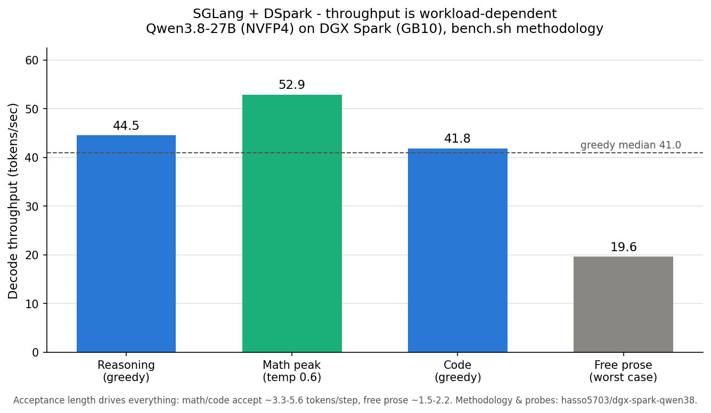
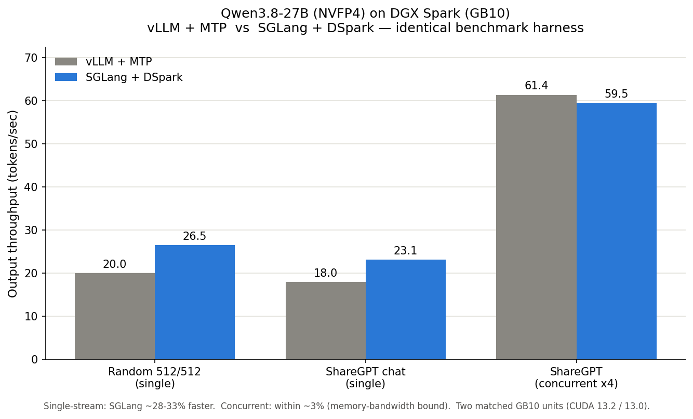

# Qwen3.8-27B (NVFP4) on DGX Spark - vLLM vs SGLang

Deploying and benchmarking **Qwen3.8-27B** in **NVFP4** on a single **NVIDIA DGX Spark (GB10, 128 GB unified LPDDR5X)** across two inference engines:

- **vLLM** with **MTP** speculative decoding
- **SGLang** with **DSpark** speculative decoding

Every command below is reproducible. A field-notes section documents the GB10 unified-memory leak that will bite anyone running this setup, and how to survive it.

## Credits

The SGLang + DSpark configuration, the tuning flags, and the `bench.sh` benchmark methodology come from **[hasso5703/dgx-spark-qwen38](https://github.com/hasso5703/dgx-spark-qwen38)** (and the accompanying [NVIDIA Developer Forums thread](https://forums.developer.nvidia.com/t/qwen3-8-27b-at-34-38-tok-s-on-dgx-spark-open-source-one-command-setup-sglang-nvfp4-dspark/380257)). That repo did the hard work of finding the fastest validated GB10 config; this repo reproduces it on separate hardware, adds a fair side-by-side against vLLM, and documents the operational pitfalls. All credit for the DSpark recipe and the "34–38 tok/s" result is theirs.

---

## TL;DR result

**Throughput on this model is workload-dependent — a single number is misleading.** Speculative decoding (both MTP and DSpark) speeds you up in proportion to how predictably the *next* tokens can be guessed. Structured output (code, math, reasoning) accepts 3.3–5.6 draft tokens/step and runs fast; free-form prose accepts ~1.5–2.2 and runs slow. Always benchmark your actual traffic.

### SGLang + DSpark, per workload (`bench.sh` methodology)



| Probe | This box | Reference box* |
|---|---|---|
| Reasoning (greedy) | 40–45 tok/s | 52–57 |
| Math peak (temp 0.6) | 40–53 tok/s | 50–60 |
| Code (greedy) | 37–42 tok/s | 41–47 |
| Free prose (worst case, excluded from median) | 18–20 tok/s | ~23 |
| **Greedy median** | **41.0 tok/s** | ~50 |

\*Reference numbers from [hasso5703/dgx-spark-qwen38](https://github.com/hasso5703/dgx-spark-qwen38). Differences are within the boot-to-boot / driver / power-cap variance that repo documents ("the boot lottery"). This box: CUDA 13.2.

### vLLM vs SGLang on the shared harness (`bench_serving`, general/prose regime)



| Workload | vLLM + MTP | SGLang + DSpark | Winner |
|---|---|---|---|
| Random 512/512 (single) | 20.0 tok/s | 26.5 tok/s | SGLang +33% |
| ShareGPT chat (single) | 18.0 tok/s | 23.1 tok/s | SGLang +28% |
| ShareGPT concurrent x4 | 61.4 tok/s | 59.5 tok/s | tie (vLLM +3%) |
| TTFT (single) | ~440 ms | ~301 ms | SGLang |
| TPOT (single) | ~49 ms | ~37–43 ms | SGLang |
| Max context served | 65,536 | 262,144 | SGLang |

> These `bench_serving` runs use random tokens and diverse chat — the *general/prose* regime, which is the low end for both engines. The code/math numbers above (40–53) and these prose numbers (23–26) are the same engine on different content, not a contradiction.

**Verdict:** SGLang + DSpark is the pick — ~40 tok/s median on code/math/reasoning, ~30% faster than vLLM single-stream on prose, lower latency, and 4× the context (262K vs 65K). Under heavy concurrency both converge to ~60 tok/s aggregate. vLLM remains a solid, simpler fallback.

> Note: the two engines were benchmarked on two different (but matched) DGX Spark units with slightly different driver stacks (CUDA 13.2 vs 13.0). Part of the single-stream gap could be hardware/driver variance.

---

## Hardware & environment

| Item | Value |
|---|---|
| Device | NVIDIA DGX Spark |
| Chip | GB10 (Grace-Blackwell), unified memory |
| Memory | 128 GB LPDDR5X (shared CPU+GPU), ~225 GB/s usable bandwidth |
| Driver | 580–595.x, CUDA 13.0 / 13.2 |
| Model | `Qwen3.8-27B` NVFP4 (W4A4) |
| Weights (vLLM) | `Inferact/Qwen3.8-27B-NVFP4` |
| Weights (SGLang) | `RadixArk/Qwen3.8-27B-NVFP4` + `RadixArk/Qwen3.8-27B-DSpark` |

Why NVFP4: on a 128 GB unified-memory box, NVFP4 (~25 GB of weights) leaves the most room for KV cache and batching. BF16 (~67 GB) and FP8 (~38 GB) crowd it out.

---

## 0. Prerequisites — verify the box

```bash
docker --version
nvidia-smi | head -5
docker run --rm --gpus all nvidia/cuda:13.0.0-base-ubuntu24.04 nvidia-smi
```

Confirm Docker runs, note the CUDA version (13.x → use the `qwen38` image tag), and that the GB10 is visible **inside** a container. If the third command fails with "could not select device driver", install the container toolkit:

```bash
sudo apt-get install -y nvidia-container-toolkit
sudo nvidia-ctk runtime configure --runtime=docker
sudo systemctl restart docker
```

> On GB10, `nvidia-smi` reports `Memory-Usage: Not Supported` — this is normal for unified memory, not an error.

---

## 1. Deploy with vLLM + MTP

### Pull the image

```bash
docker pull vllm/vllm-openai:qwen38
```

### Launch

```bash
docker run -d --name vllm-qwen38 --gpus all \
  -p 8000:8000 \
  -v ~/.cache/huggingface:/root/.cache/huggingface \
  --ipc=host \
  --memory=100g --memory-swap=100g \
  vllm/vllm-openai:qwen38 \
  --model Inferact/Qwen3.8-27B-NVFP4 \
  --served-model-name qwen38-27b \
  --tensor-parallel-size 1 \
  --max-model-len 65536 \
  --max-num-seqs 8 \
  --max-num-batched-tokens 8192 \
  --gpu-memory-utilization 0.60 \
  --kv-cache-dtype fp8 \
  --reasoning-parser qwen3 \
  --enable-auto-tool-choice --tool-call-parser qwen3_coder \
  --speculative-config '{"method":"mtp","num_speculative_tokens":3}'
```

### Watch it come up

```bash
docker logs -f vllm-qwen38          # wait for "Application startup complete"
curl http://localhost:8000/v1/models | jq
```

### Key flag notes (GB10-specific)

| Flag | Value | Why |
|---|---|---|
| `--gpu-memory-utilization` | **0.60** | Memory is shared with the OS. 0.85–0.95 OOMs the host on GB10. Keep it low. |
| `--tensor-parallel-size` | 1 | Single GB10 — TP is a no-op. |
| `--max-model-len` | 65536 | Smaller KV footprint; raise only if you need the context. |
| `--speculative-config` MTP | n=3 | Built-in draft head. Biggest single-stream speedup lever for vLLM. |
| `--kv-cache-dtype fp8` | — | Halves KV memory. (On GB10, native KV sometimes decodes faster — worth A/B testing.) |

---

## 2. Deploy with SGLang + DSpark

DSpark is a trained block-drafter that accepts more tokens per speculation step than MTP. It is the reason SGLang wins single-stream. The tuning flags matter a lot — a naive launch (missing `--enable-torch-compile` and `--num-continuous-decode-steps`) collapses acceptance and throughput.

### Pull the image

```bash
docker pull lmsysorg/sglang:qwen38-27b
```

### Launch (fully tuned)

```bash
docker run -d --name sglang-qwen38 --gpus all \
  --shm-size 32g \
  -p 30000:30000 \
  -v ~/.cache/huggingface:/root/.cache/huggingface \
  --ipc=host \
  --memory=100g --memory-swap=100g \
  lmsysorg/sglang:qwen38-27b \
  python3 -m sglang.launch_server \
  --trust-remote-code \
  --model-path RadixArk/Qwen3.8-27B-NVFP4 \
  --speculative-algorithm DSPARK \
  --speculative-draft-model-path RadixArk/Qwen3.8-27B-DSpark \
  --speculative-draft-attention-backend flashinfer \
  --kv-cache-dtype fp8_e4m3 \
  --mem-fraction-static 0.50 \
  --attention-backend flashinfer \
  --enable-torch-compile --torch-compile-max-bs 4 \
  --num-continuous-decode-steps 2 \
  --mamba-full-memory-ratio 8.26 \
  --chunked-prefill-size 8192 \
  --disable-prefill-cuda-graph \
  --reasoning-parser qwen3 \
  --tool-call-parser qwen3_coder \
  --host 0.0.0.0 \
  --port 30000
```

### Watch it come up

```bash
docker logs -f sglang-qwen38        # wait for "The server is fired up and ready to roll!"
curl http://localhost:30000/v1/models | jq
```

First boot runs `torch.compile` (~9 min); later boots use the compile cache and start faster.

### Critical flags

| Flag | Value | Why |
|---|---|---|
| `--speculative-algorithm DSPARK` | — | The trained block-drafter. Core of the speedup. |
| `--enable-torch-compile` + `--torch-compile-max-bs 4` | — | **Required.** Without it, DSpark acceptance collapses (~1.7) and throughput tanks. |
| `--num-continuous-decode-steps` | 2 | Cuts scheduler overhead per token. |
| `--mamba-full-memory-ratio` | 8.26 | Tunes the hybrid Mamba state-cache memory. Part of the validated recipe; without it, code/math throughput is lower. |
| `--mem-fraction-static` | **0.50** | **Safety-critical on GB10.** Higher values risk a host memory freeze (see field notes). |
| `--disable-prefill-cuda-graph` | — | DGX-Spark-specific; avoids a known graph issue on GB10. |

> **One engine at a time.** GB10 is effectively batch-1-per-moment. Do not run vLLM and SGLang simultaneously — they share the memory bus and each runs at roughly half speed. Stop one before starting the other.

---

## 3. Make it permanent (systemd)

Running via a bare `docker run` means the model is gone after a reboot or power loss. The unit below auto-starts on boot, force-cleans stale containers (prevents the GB10 leak-on-restart cycle), and caps memory so a runaway kills the container instead of freezing the host.

`/etc/systemd/system/sglang-qwen38.service`:

```ini
[Unit]
Description=SGLang Qwen3.8-27B (NVFP4 + DSpark) on DGX Spark
After=docker.service network-online.target
Requires=docker.service
Wants=network-online.target

[Service]
Type=simple
Restart=on-failure
RestartSec=30
TimeoutStartSec=1200
TimeoutStopSec=60

ExecStartPre=-/usr/bin/docker stop -t 30 sglang-qwen38
ExecStartPre=-/usr/bin/docker rm -f sglang-qwen38

ExecStart=/usr/bin/docker run --rm --name sglang-qwen38 --gpus all \
  --shm-size 32g \
  -p 30000:30000 \
  -v /home/USER/.cache/huggingface:/root/.cache/huggingface \
  --ipc=host \
  --memory=100g --memory-swap=100g \
  lmsysorg/sglang:qwen38-27b \
  python3 -m sglang.launch_server \
  --trust-remote-code \
  --model-path RadixArk/Qwen3.8-27B-NVFP4 \
  --speculative-algorithm DSPARK \
  --speculative-draft-model-path RadixArk/Qwen3.8-27B-DSpark \
  --speculative-draft-attention-backend flashinfer \
  --kv-cache-dtype fp8_e4m3 \
  --mem-fraction-static 0.50 \
  --attention-backend flashinfer \
  --enable-torch-compile --torch-compile-max-bs 4 \
  --num-continuous-decode-steps 2 \
  --mamba-full-memory-ratio 8.26 \
  --chunked-prefill-size 8192 \
  --disable-prefill-cuda-graph \
  --reasoning-parser qwen3 \
  --tool-call-parser qwen3_coder \
  --host 0.0.0.0 \
  --port 30000

ExecStop=/usr/bin/docker stop -t 30 sglang-qwen38

[Install]
WantedBy=multi-user.target
```

Replace `/home/USER/` with your actual home path. Then:

```bash
sudo systemctl daemon-reload
sudo systemctl enable sglang-qwen38
sudo systemctl start sglang-qwen38
sudo journalctl -u sglang-qwen38 -f
```

An equivalent unit works for vLLM (swap the name, port `8000`, and the `docker run` body). Keep only **one** engine `enabled` at a time to avoid a boot-time collision.

Management:

```bash
sudo systemctl start|stop|restart sglang-qwen38
systemctl status sglang-qwen38
sudo journalctl -u sglang-qwen38 -f
```

---

## 4. Benchmark - identical harness for both engines

The benchmark client is `sglang.bench_serving`, run from the SGLang image. It is engine-agnostic (speaks the OpenAI API via `--backend sglang-oai`), so pointing the same tool at each server is what makes the comparison fair. The client needs no GPU — ignore its "NVIDIA Driver was not detected" warning.

Two name arguments are required:
- `--model` → the name the **server** accepts (vLLM: `qwen38-27b`; SGLang: `RadixArk/Qwen3.8-27B-NVFP4`)
- `--tokenizer` → a real HF repo for token counting (use the same tokenizer for both to remove a variable)

### Against SGLang (port 30000)

```bash
# A) Random 512/512, single-stream
docker run --rm --network host lmsysorg/sglang:qwen38-27b \
  python3 -m sglang.bench_serving --backend sglang-oai \
  --host 0.0.0.0 --port 30000 \
  --model RadixArk/Qwen3.8-27B-NVFP4 --tokenizer RadixArk/Qwen3.8-27B-NVFP4 \
  --dataset-name random --random-input-len 512 --random-output-len 512 --random-range-ratio 1 \
  --num-prompts 20 --max-concurrency 1 --request-rate inf --flush-cache

# B) ShareGPT (real chat), single-stream
docker run --rm --network host lmsysorg/sglang:qwen38-27b \
  python3 -m sglang.bench_serving --backend sglang-oai \
  --host 0.0.0.0 --port 30000 \
  --model RadixArk/Qwen3.8-27B-NVFP4 --tokenizer RadixArk/Qwen3.8-27B-NVFP4 \
  --dataset-name sharegpt --num-prompts 20 --max-concurrency 1 --request-rate inf --flush-cache

# C) ShareGPT concurrent x4
docker run --rm --network host lmsysorg/sglang:qwen38-27b \
  python3 -m sglang.bench_serving --backend sglang-oai \
  --host 0.0.0.0 --port 30000 \
  --model RadixArk/Qwen3.8-27B-NVFP4 --tokenizer RadixArk/Qwen3.8-27B-NVFP4 \
  --dataset-name sharegpt --num-prompts 40 --max-concurrency 4 --request-rate inf --flush-cache
```

### Against vLLM (port 8000)

Same three commands, but `--host 0.0.0.0 --port 8000` and `--model qwen38-27b`. Keep `--tokenizer` identical for a clean comparison:

```bash
docker run --rm --network host lmsysorg/sglang:qwen38-27b \
  python3 -m sglang.bench_serving --backend sglang-oai \
  --host 0.0.0.0 --port 8000 \
  --model qwen38-27b --tokenizer Inferact/Qwen3.8-27B-NVFP4 \
  --dataset-name random --random-input-len 512 --random-output-len 512 --random-range-ratio 1 \
  --num-prompts 20 --max-concurrency 1 --request-rate inf
# ...repeat with --dataset-name sharegpt (single and --max-concurrency 4)
```

`--flush-cache` clears SGLang's radix (prefix) cache before each run so results are cold and comparable. You can also flush manually: `curl -X POST http://localhost:30000/flush_cache`.

---

## 5. Full results

### vLLM + MTP

| Metric | Random 512 | ShareGPT single | ShareGPT x4 |
|---|---|---|---|
| Output throughput (tok/s) | 20.0 | 18.0 | 61.4 |
| Total throughput (tok/s) | 40.0 | 43.5 | 189.3 |
| Mean TTFT (ms) | 440 | 432 | 733 |
| Mean TPOT (ms) | 49.3 | 53.5 | 57.6 |

### SGLang + DSpark — bench_serving (general/prose regime)

| Metric | Random 512 | ShareGPT single | ShareGPT x4 |
|---|---|---|---|
| Output throughput (tok/s) | 26.5 | 23.1 | 59.5 |
| Total throughput (tok/s) | 53.1 | 55.8 | 183.5 |
| Accept length | 2.78 | 2.47 | 2.30 |
| Mean TTFT (ms) | 301 | 302 | 487 |
| Mean TPOT (ms) | 37.2 | 43.5 | 63.8 |

### SGLang + DSpark — bench.sh (code/math/reasoning regime)

Run with `./bench.sh` from [hasso5703/dgx-spark-qwen38](https://github.com/hasso5703/dgx-spark-qwen38) against the running server (two probes each, greedy unless noted):

| Probe | Run 1 / Run 2 (tok/s) |
|---|---|
| Code (greedy) | 41.8 / 37.4 |
| Reasoning (greedy) | 40.1 / 44.5 |
| Math peak (temp 0.6) | 40.3 / 52.9 |
| Free prose (worst case, excluded from median) | 19.6 / 18.0 |
| **Greedy median** | **41.0** |

### Reading the numbers

- **There is no single "the tok/s".** Same engine, same config: ~40–53 on code/math/reasoning, ~18–26 on free prose/chat. The difference is entirely **DSpark acceptance length** — how many draft tokens get accepted per step (3.3–5.6 for structured output, 1.5–2.2 for prose). This is inherent to speculative decoding, not a config problem.
- **Which number to quote** depends on your traffic. Coding/agent/reasoning workloads → 40+. General chat → low-20s. Mixed → somewhere between.
- **Two measurement harnesses, two purposes.** `bench_serving` (random + ShareGPT) is good for a fair, rigorous vLLM-vs-SGLang comparison on general text. `bench.sh` (code/math/reasoning probes, thinking-token-aware streaming) reproduces the published headline numbers. Both are valid; they measure different content.
- **Concurrent** saturates memory bandwidth for both engines, so speculation matters less and they converge (~60 tok/s aggregate).
- **A single curl-timed prompt is not a benchmark.** Naive curl timing that only counts visible tokens (missing the thinking phase) inflates tok/s several-fold. Use `bench_serving` or `bench.sh`, which count reasoning tokens correctly.

---

## 6. Field notes — the GB10 unified-memory leak

This is the single biggest operational gotcha on DGX Spark. Read this before you run anything in production.

### Symptom

After a vLLM/SGLang container crashes or is torn down, memory is **not released**. `free -h` shows ~90–100 GiB "used" while `nvidia-smi` shows no GPU processes and `ps` accounts for barely 1–2 GiB. The next launch then fails:

```
ValueError: Free memory on device cuda:0 (18.61/121.69 GiB) on startup is less
than desired GPU memory utilization (0.75, 103.44 GiB).
```

### Cause

On the GB10's unified memory, a CUDA process that exits uncleanly (OOM during engine init, a crash mid-compile) leaks its allocation to the driver. The memory is invisible to `ps` and `nvidia-smi` (which reports `N/A` for used memory on GB10). A `--restart` loop makes it worse: each crash leaks again, compounding until startup is impossible.

### What does NOT clear it

- `docker restart` / `systemctl restart docker` — no effect
- `nvidia-smi --gpu-reset` — fails with "In use by another client" (the phantom holder)

### What DOES clear it

- **A reboot.** Reliable, clears the phantom reservation.
- A **graceful** `docker stop -t 30` (vs `kill`) leaks *less*, but not zero.

### How to avoid it

1. **Test new configs without a restart policy first.** Use a bare `docker run` (no `--restart`). If the config is wrong, it fails once and stops — instead of crash-looping and leaking. Add `--restart` / systemd only after the config is proven stable.
2. **Keep `--gpu-memory-utilization` (vLLM) / `--mem-fraction-static` (SGLang) conservative.** vLLM 0.60, SGLang 0.50. This leaves margin so a small residual leak doesn't block the next start.
3. **Use a hard memory cap** (`--memory=100g`) so a runaway kills the container, not the host.
4. **Use `ExecStartPre=-docker rm -f` in systemd** so a stale container never blocks startup.
5. **Manage via `systemctl`, not `docker`** once deployed — the graceful `ExecStop` releases memory more cleanly.

### Recovery runbook

```bash
# 1. Stop the engine (systemd, so it doesn't auto-restart)
sudo systemctl stop <engine>-qwen38

# 2. Check memory
free -h

# 3. If still ~90+ GiB used with nothing running -> reboot
sudo reboot

# 4. After reboot, confirm clean (~115 GiB free), then start
free -h
sudo systemctl start <engine>-qwen38
```

---

## 7. Serving to clients (OpenWebUI etc.)

Both engines expose an OpenAI-compatible API. Point any client at:

- vLLM: `http://<host>:8000/v1`, model `qwen38-27b`
- SGLang: `http://<host>:30000/v1`, model `RadixArk/Qwen3.8-27B-NVFP4`

API key can be any non-empty string (auth is off by default). On a private overlay (Tailscale/ZeroTier/LAN) this is fine; open ports get `--api-key <secret>` on the server and the same key in the client.

---

## Appendix — quick reference

```bash
# Status
systemctl status sglang-qwen38
curl http://localhost:30000/v1/models | jq

# Logs
sudo journalctl -u sglang-qwen38 -f
docker logs --tail 20 sglang-qwen38 2>&1 | grep 'gen throughput'   # live decode tok/s + accept len

# Switch engines (one at a time!)
sudo systemctl stop sglang-qwen38
sudo systemctl start vllm-qwen38

# Flush prefix cache (SGLang) before a fresh benchmark
curl -X POST http://localhost:30000/flush_cache
```

---

## Acknowledgments

- **[hasso5703/dgx-spark-qwen38](https://github.com/hasso5703/dgx-spark-qwen38)** — the validated SGLang + NVFP4 + DSpark configuration, the tuning flags (`--mem-fraction-static 0.50`, `--enable-torch-compile`, `--num-continuous-decode-steps 2`, `--mamba-full-memory-ratio 8.26`), and the `bench.sh` benchmark methodology. The "34–38 tok/s" headline and the per-workload profile originate there. This repo reproduces their result on separate hardware and adds a vLLM comparison; the SGLang recipe is entirely their work.
- **[NVIDIA DGX Spark / GB10 forum thread](https://forums.developer.nvidia.com/t/qwen3-8-27b-at-34-38-tok-s-on-dgx-spark-open-source-one-command-setup-sglang-nvfp4-dspark/380257)** — community discussion and cross-validation.
- **[SGLang](https://github.com/sgl-project/sglang)** and **[vLLM](https://github.com/vllm-project/vllm)** — the inference engines.
- Model weights: `RadixArk/Qwen3.8-27B-NVFP4`, `RadixArk/Qwen3.8-27B-DSpark`, `Inferact/Qwen3.8-27B-NVFP4` on Hugging Face.

---

*Reproduced on single-unit DGX Spark (GB10). Numbers will vary with driver version, workload, temperature, and DSpark acceptance. Benchmark your own traffic shape before drawing conclusions.*
